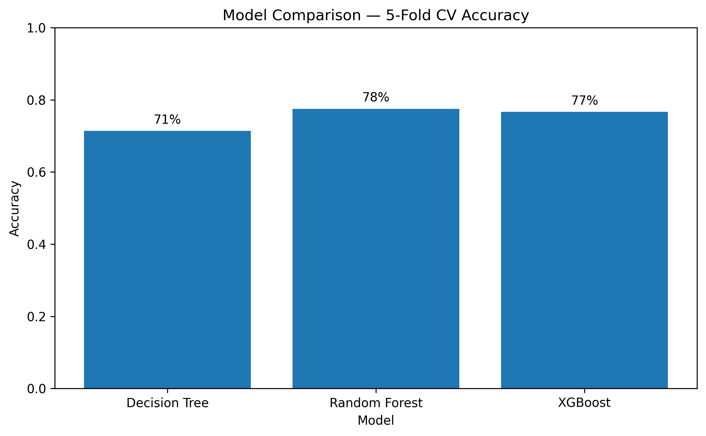
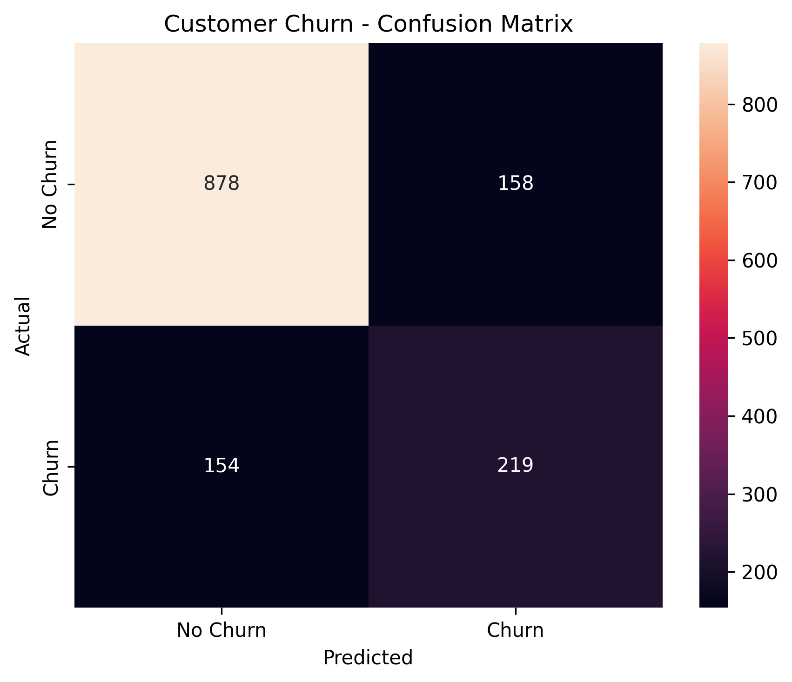
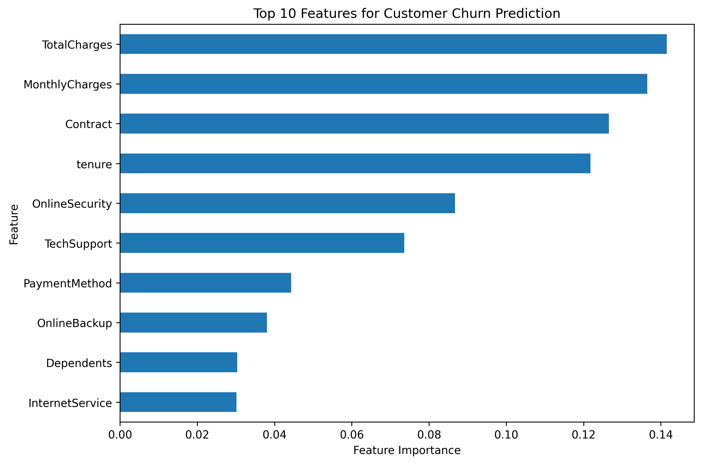

# Customer Churn Prediction using Machine Learning

An end-to-end machine learning project that predicts customer churn using customer demographics, service usage, contract information, and billing details.

The project covers data preprocessing, exploratory data analysis, class imbalance handling using SMOTE, model comparison, evaluation, model persistence, and prediction on unseen customer records.

---

## Business Problem

Customer churn can affect recurring revenue and customer retention.

The objective of this project is to identify customers who are more likely to churn so that businesses can better understand churn patterns and prioritize retention efforts.

---

## Project Objectives

- Clean and preprocess customer data
- Perform exploratory data analysis (EDA)
- Encode categorical features for machine learning
- Handle class imbalance using SMOTE
- Compare multiple classification models
- Evaluate model performance using classification metrics
- Save the trained model and preprocessing encoders
- Generate predictions for new customer records

---

## Dataset

**Dataset:** Telco Customer Churn Dataset

- Records: 7,043 customers
- Original features: 20
- Target variable: Churn
- Target classes: Yes / No

The dataset contains information related to customer demographics, services, contracts, payment methods, monthly charges, and total charges.

The raw dataset is not included in this repository.

---

## Technologies Used

- Python
- NumPy
- Pandas
- Matplotlib
- Seaborn
- Scikit-learn
- Imbalanced-learn
- XGBoost
- Pickle
- Jupyter Notebook
- Google Colab

---

## Project Workflow

### 1. Data Loading and Cleaning

- Loaded the Telco Customer Churn dataset
- Removed the `customerID` column
- Converted `TotalCharges` to a numeric data type
- Handled missing values
- Converted the target variable into binary format

### 2. Exploratory Data Analysis

Explored customer characteristics and churn distribution using:

- Distribution analysis
- Count plots
- Box plots
- Correlation analysis
- Descriptive statistics

### 3. Feature Processing

- Identified categorical features
- Applied Label Encoding to categorical variables
- Preserved fitted encoders for future predictions
- Separated features and target variable

### 4. Train-Test Split

The dataset was divided into:

- 80% training data
- 20% test data

A fixed random state was used to make the experiment reproducible.

### 5. Handling Class Imbalance

The target variable contained more non-churn customers than churn customers.

SMOTE (Synthetic Minority Oversampling Technique) was used to balance the training data.

For cross-validation, SMOTE was applied within each training fold to avoid applying oversampling to validation data.

### 6. Model Development

Three classification models were evaluated:

- Decision Tree
- Random Forest
- XGBoost

### 7. Model Evaluation

Models were compared using 5-fold stratified cross-validation.

The final Random Forest model was evaluated on the held-out test set using:

- Accuracy
- Precision
- Recall
- F1-Score
- Confusion Matrix

---

## Model Comparison

### 5-Fold Cross-Validation Accuracy

| Model | CV Accuracy |
|---|---:|
| Decision Tree | 71% |
| Random Forest | 78% |
| XGBoost | 77% |



Random Forest achieved the highest cross-validation accuracy among the evaluated models.

---

## Final Model Performance

The Random Forest model was evaluated on the held-out test set.

| Metric | Score |
|---|---:|
| Accuracy | 77.9% |
| Churn Precision | 58% |
| Churn Recall | 59% |
| Churn F1-Score | 58% |

The churn class was evaluated separately because correctly identifying customers who may churn is important for customer retention analysis.

---

## Confusion Matrix

The confusion matrix shows the model's predictions on the held-out test data.



The model correctly identified:

- 878 customers as No Churn
- 219 customers as Churn

It incorrectly classified:

- 158 No Churn customers as Churn
- 154 Churn customers as No Churn

---

## Feature Importance

Random Forest feature importance was used to examine which customer attributes contributed most to the model's predictions.



This provides an additional view of the factors the model used when predicting customer churn.

---

## Model Persistence

The trained model and preprocessing objects are saved for future inference.

### Saved Artifacts

- `customer_churn_model.pkl` — trained Random Forest model and feature names
- `encoders.pkl` — fitted categorical encoders used during prediction

---

## Prediction

The project includes a prediction script that loads the saved model and encoders and generates a churn prediction for a new customer record.

Example output:

```text
Prediction: No Churn
Prediction Probability: [0.78 0.22]
